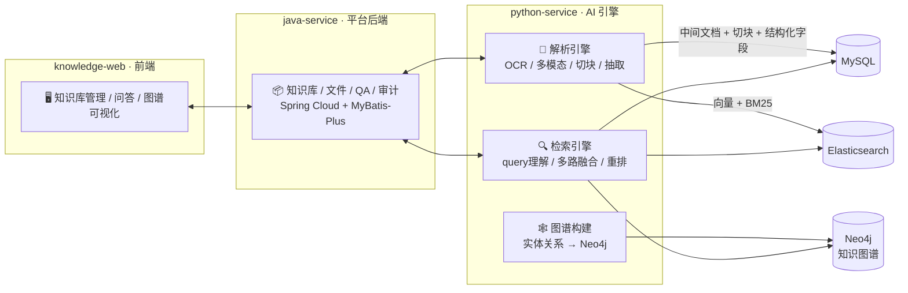
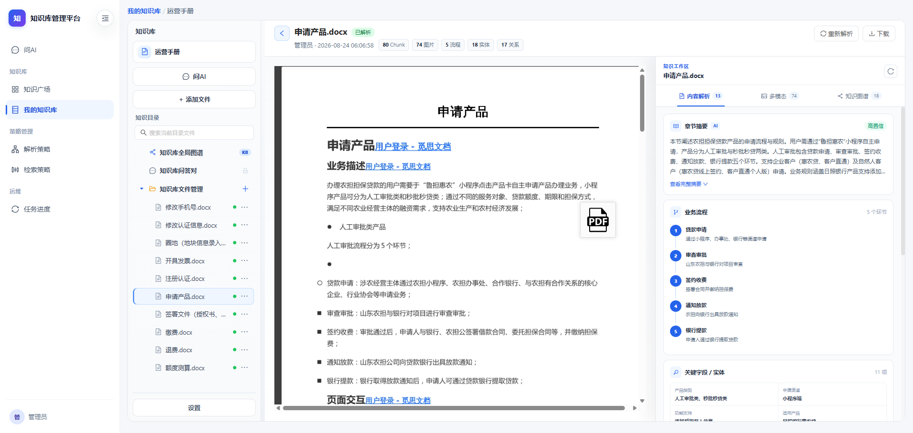
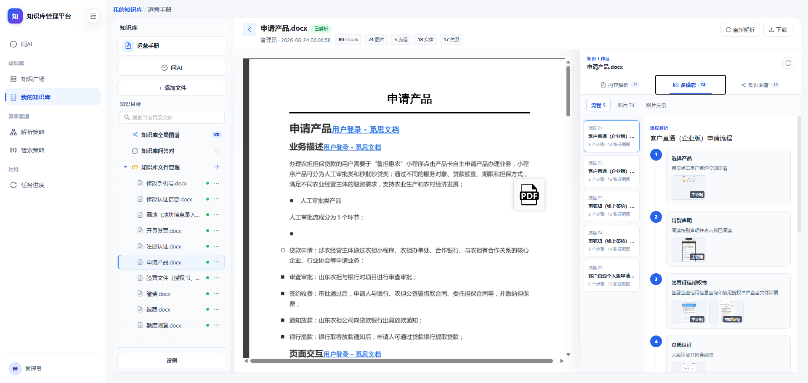
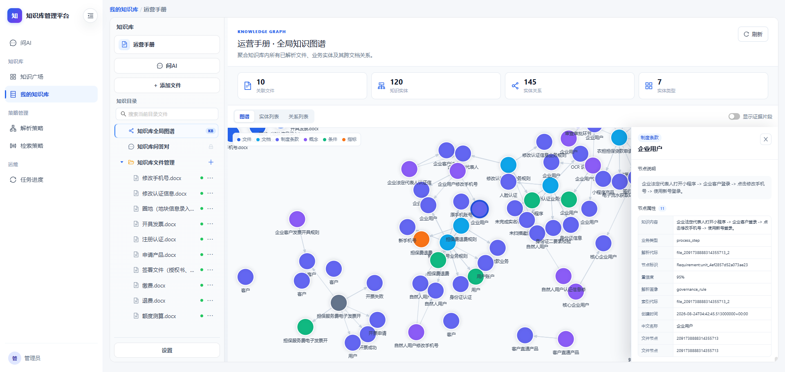
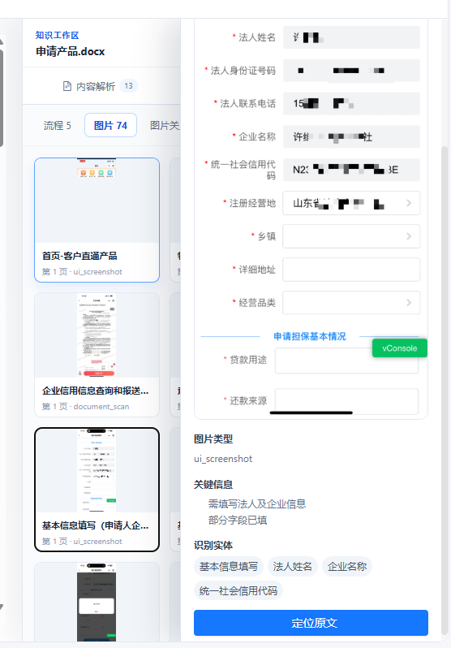

<div align="center">

```text
 ______ _   _ _______ ______ _____  _____  _____  _____  _____ ______ 
|  ____| \ | |__   __|  ____|  __ \|  __ \|  __ \|_   _|/ ____|  ____|
| |__  |  \| |  | |  | |__  | |__) | |__) | |__) | | | | (___ | |__   
|  __| | . ` |  | |  |  __| |  _  /|  ___/|  _  /  | |  \___ \|  __|  
| |____| |\  |  | |  | |____| | \ \| |    | | \ \ _| |_ ____) | |____ 
|______|_| \_|  |_|  |______|_|  \_\_|    |_|  \_\_____|_____/|______|
```

<br/>

# 🧠 Enterprise Knowledge RAG

**企业知识库 · 多模态文档解析 · 知识图谱 · 混合检索 · 溯源问答**

*从一份文档，到一张知识图谱，再到可溯源的回答。*

<br/>

[](https://github.com/837515265/Enterprise-Knowledge-RAG)
[]()
[]()
[]()
[]()
[]()
[]()
[]()
[]()
[]()

</div>

---

## ✨ 核心特性

<table>
<tr>
<td width="33%"><b>🧠 多模态文档解析</b><br/><sub>PDF / Word / 图片 / 扫描件统一解析；Paddle 版面 + 千帆 VLM 双 OCR 后端；分层多图解析（manifest + 多图联合），图表、流程图、单据图像智能提取。</sub></td>
<td width="33%"><b>✂️ 结构化智能切块</b><br/><sub>目录（Catalog）、AST、容器三种切块策略；章节摘要、锚点单元、答案预构建，让每一段文本都可被精准定位与引用。</sub></td>
<td width="33%"><b>🕸️ 知识图谱构建</b><br/><sub>业务实体 / 关系 / 制度条款自动抽取 → Neo4j；GraphRAG 社区发现与治理，全局 + 文档级双视角图谱检索。</sub></td>
</tr>
<tr>
<td width="33%"><b>🔍 混合检索</b><br/><sub>query 理解 + 向量（BGE-M3）+ BM25 + 图谱检索多路融合；重排（BGE-Reranker）与置信度打分，检索精准可控。</sub></td>
<td width="33%"><b>✅ 证据溯源</b><br/><sub>答案逐条绑定原文 / 流程图步骤 / 图片证据（主证据 / 辅助证据 + 置信度）；一键定位原文，多模态「图片 → 原图」闭环。</sub></td>
<td width="33%"><b>🔐 企业级能力</b><br/><sub>知识库权限与成员管理、解析策略 / 检索策略配置、分块人工审计、全链路操作留痕，满足生产级治理要求。</sub></td>
</tr>
</table>

---

## 🏗️ 系统架构



---

## 📸 界面一览

<table>
<tr>
<td width="50%" align="center">
  
  <br/><sub>📄 <b>多模态文档解析</b> — 章节摘要 / 业务流程抽取 / 关键字段，80 Chunk · 74 图片 · 18 实体</sub>
</td>
<td width="50%" align="center">
  
  <br/><sub>🧩 <b>流程级多模态解析</b> — 步骤时间线 + 图片证据（主证据 / 辅助证据）</sub>
</td>
</tr>
<tr>
<td width="50%" align="center">
  
  <br/><sub>🕸️ <b>全局知识图谱</b> — 120 知识实体 · 145 实体关系 · 节点属性抽屉</sub>
</td>
<td width="50%" align="center">
  
  <br/><sub>🖼️ <b>图片证据溯源</b> — 原图定位 + 移动端表单还原</sub>
</td>
</tr>
</table>

---

## 🛠️ 技术栈

| 层 | 技术 |
| --- | --- |
| 🧠 解析 / 检索引擎 | Python 3.10 · FastAPI · PyMuPDF · PaddleOCR · 千帆 VLM · jieba |
| 🔍 存储 / 检索 | Elasticsearch 7.x（向量 + BM25）· Redis · MySQL |
| 🕸️ 知识图谱 | Neo4j 5.x · GraphRAG 社区治理 / 受限扩散检索 |
| 📦 平台后端 | Java 8 · Spring Cloud · MyBatis-Plus · Feign · Nacos · XXL-Job |
| 🖥️ 前端 | Vue 3 · Vite · Ant Design Vue · G6（图谱可视化） |

---

## 🚀 快速开始

仓库由三个子项目组成，各自有独立的 README 与配置模板：

```bash
# 1. 解析 / 检索引擎（AI 引擎）
cd python-service
copy .env.example .env          # 填写 MySQL / ES / Neo4j / Redis / 模型配置
uvicorn danbao_poc.api.app_service:app

# 2. 平台后端
cd java-service
mvn clean install
# 复制脱敏配置：app-knowledge-service/src/main/resources/application-local.yml.example → application-local.yml

# 3. 前端
cd knowledge-web
npm install
npm run dev
```

> 运行依赖 MySQL、Elasticsearch、Neo4j、Redis 与文件中心，具体配置字段见各子项目说明。

---

## 📦 仓库结构

```text
Enterprise-Knowledge-RAG/
├── python-service/         # 解析 / 检索 AI 引擎（FastAPI）
│   ├── src/danbao_poc/     #   核心包：解析 · 切块 · 抽取 · 图谱 · 检索
│   ├── deploy/             #   部署配置模板（docker-compose / nacos / nginx）
│   └── doc/                #   技术方案与设计文档
├── java-service/           # 知识库平台后端（Spring Cloud）
│   ├── app-knowledge-service/    # 服务端（含 SQL 脚本 / MyBatis Mapper）
│   ├── app-knowledge-api/        # 接口 / DTO 模块
│   └── docs/               #   架构设计 / 数据库设计
├── knowledge-web/          # 知识库管理前端（Vue 3 + G6）
│   └── src/views/knowledge/      # 知识库 / 文件 / 分块 / 策略 / 图谱 / 问答页面
└── assets/screenshots/     # 产品界面截图
```

---

## 🗺️ 路线图

- ✅ 多模态分层解析：manifest + 多图联合 + 图片字节剥离
- ✅ 全局 / 文档级知识图谱检索 · 图谱治理与受限扩散
- ✅ 检索证据溯源：流程证据 / 图片证据 / 引用格式化
- 🔜 ColPali 视觉检索接入（可行性分析已完成）
- 🔜 VisRAG 图文混合检索增强（可行性分析已完成）
- 🔜 开放平台 SDK 与多模态问答增强

---

## 📄 更多文档

- [python-service 技术方案与设计文档](python-service/doc/00_index.md)
- [java-service 架构设计](java-service/docs/架构设计/部署环境与系统架构说明.md)
- [java-service 数据库设计](java-service/docs/数据库设计文档.md)

---

<div align="center">

**Enterprise Knowledge RAG** · 从文档到知识，从知识到答案

Made with 🧠 by the Knowledge Platform Team

</div>
