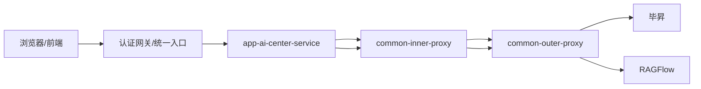

# 部署环境与系统架构说明

## AI应用开放平台环境基线

| 项目   | 内容                     |
| ---- | ---------------------- |
| 文档定位 | 环境基线文档                 |
| 适用范围 | `AI应用开放平台` / `知识库管理中心` |
| 创建日期 | 2026-04-15             |
| 主要用途 | 说明部署位置、系统职责、网络链路与外部依赖  |

---

## 一、文档目的

本文档只回答三件事：

1. 系统部署在哪里。
2. 系统之间怎么连。
3. 哪些是主平台，哪些是外部平台。

本文档不承担产品需求说明或架构设计说明职责；业务流程、模块设计、适配器模式等内容以版本目录下正式文档为准。

---

## 二、当前部署环境总览

### 2.1 三个平台

当前涉及三个平台：

1. **AI应用开放平台**
  - 部署在华为云微服务体系
  - 是业务主平台
  - 当前由 `app-ai-center-service` 与相关前端承载
  - 当前重点涉及 `工作台`、`体验中心`、`智能体管理中心`、`知识库管理中心`
2. **Bisheng 智能体开发平台**
  - 部署在算力服务器
  - 基于源码二开
3. **RAGFlow 知识库管理平台**
  - 部署在算力服务器
  - 基于源码二开

### 2.2 算力侧已部署系统

| 系统           | 说明                        |
| ------------ | ------------------------- |
| `RAGFlow`    | 数据集、文档解析、chunk、检索、问答等知识能力 |
| `Bisheng`    | 智能体开发、工作流编排、自定义节点能力       |
| `new-api`    | 模型统一接入能力                  |
| Python AI 服务 | 承载部分 LangChain 相关智能体逻辑    |
| 开源模型         | 提供底层模型能力                  |

### 2.3 业务侧环境

华为云算力服务器上部署了业务微服务体系，包含业务系统相关服务，分为 **内网区** 和 **外网区**。  
`app-ai-center-service` 位于业务微服务体系内，负责作为平台能力入口对接算力侧平台。

### 2.4 前端环境

| 工程              | 路径                                               | 说明               |
| --------------- | ------------------------------------------------ | ---------------- |
| `ai-center-web` | `/Users/yuwenqiang/Documents/LDSK/ai-center-web` | AI应用开放平台相关前端页面承载 |

---

## 三、网络与代理链路

### 3.1 总体链路

### 3.2 链路说明

| 链路                                                                                | 说明        |
| --------------------------------------------------------------------------------- | --------- |
| 前端 → 网关 → `app-ai-center-service`                                                 | 平台侧常规访问链路 |
| `app-ai-center-service` → `common-inner-proxy` → `common-outer-proxy` → `Bisheng` | 智能体平台对接链路 |
| `app-ai-center-service` → `common-inner-proxy` → `common-outer-proxy` → `RAGFlow` | 知识库平台对接链路 |

部署图内部统一按 `工作台 / 体验中心`、`智能体管理中心`、`知识库管理中心` 三类能力进行表达。

---

## 四、系统职责边界

| 系统                      | 职责              |
| ----------------------- | --------------- |
| `app-ai-center-service` | AI应用开放平台后端能力入口  |
| `ai-center-web`         | AI应用开放平台前端展示入口  |
| `common-inner-proxy`    | 业务服务区到外部系统的统一代理 |
| `common-outer-proxy`    | 跨网访问算力区的统一代理    |
| `Bisheng`               | 智能体开发与编排平台      |
| `RAGFlow`               | 知识库底层能力平台       |
| `new-api` / 模型服务        | 模型接入与模型能力承载     |
| Python AI 服务            | 特殊 AI 服务逻辑承载    |

---

## 五、当前已有基础能力

### 5.1 后端基础

- 已存在智能体调用通道能力
- 已接入 `common-inner-proxy`
- 已有 `agent_info`、`agent_channel_config`、`agent_invoke_log` 等基础表

### 5.2 前端基础

- 已有智能体管理页
- 已有体验中心门户
- 已有部分 RAGFlow 页面原型

---

## 六、本期建设依赖项

### 6.1 强依赖系统

| 依赖项                  | 作用           |
| -------------------- | ------------ |
| `RAGFlow`            | 知识库底层能力      |
| `Bisheng`            | 智能体平台协同能力    |
| `common-inner-proxy` | 业务到外部平台的统一代理 |
| `common-outer-proxy` | 跨网访问能力       |
| 网关                   | 平台统一访问入口     |
| `ai-center-web`      | 前端承载         |

### 6.2 关键配置依赖

| 配置项          | 说明                                                    |
| ------------ | ----------------------------------------------------- |
| 平台路由配置       | `app-ai-center-service` 对 `RAGFlow` / `Bisheng` 的路由映射 |
| 超时配置         | 网关、代理、外部平台接口超时                                        |
| multipart 支持 | 文档上传链路必须重点验证                                          |

---

## 七、相关文档分工

| 文档                                                | 关注点               |
| ------------------------------------------------- | ----------------- |
| `docs/V1.5.0/产品需求说明书-V1.5.0-AI应用开放平台（知识库管理中心）.md` | 本期产品范围、页面与业务规则    |
| `docs/V1.5.0/架构设计说明书-V1.5.0-AI应用开放平台（知识库管理中心）.md` | 本期架构边界、适配器模式与模块结构 |
| `docs/架构设计/部署环境与系统架构说明.md`                        | 部署环境、系统职责、网络链路与依赖 |

---

## 八、配套架构图说明

### 8.1 图文件路径

- `docs/架构设计/部署环境与系统架构图.drawio`

### 8.2 维护原则

以下情况应优先更新本文件与配套图：

- 三个平台部署位置变化
- 代理链路变化
- 外部平台增减
- 网关访问入口变化
- 前后端职责边界变化

