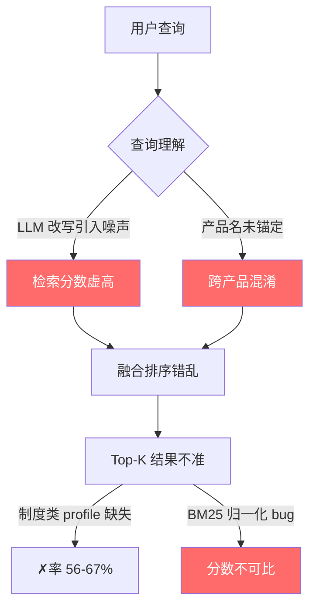
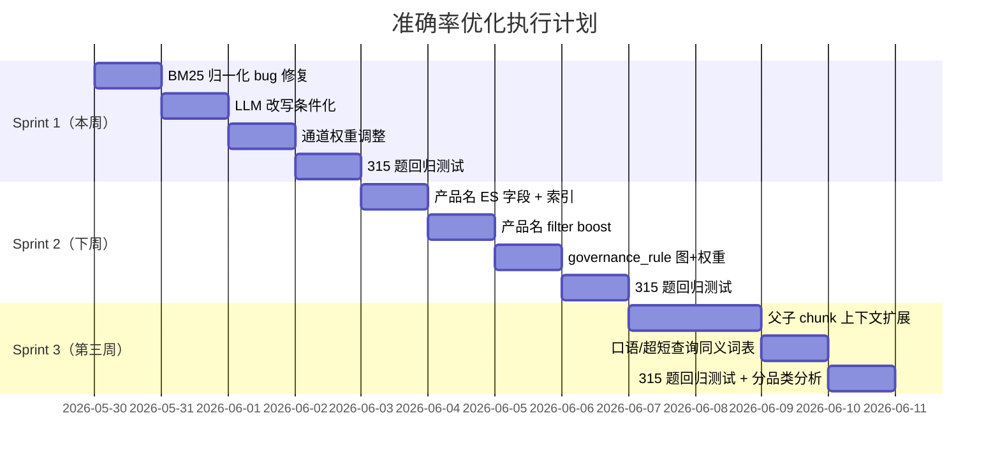

# danbao-poc 准确率提升：基于代码实际状态的优化建议

> 基于对源码 (`query.py`, `es_store.py`, `retrieval_plan.py`, `evidence_aligner.py`, `retrieval_confidence.py`, `context_budget.py`) 的完整审读，以及两份优化方案 (`OPTIMIZATION_PLAN.md`, `09_flow_layer_optimization_plan.md`) 和审阅报告的综合分析。

---

## 一、核心诊断：准确率卡在哪里？

你的项目当前 **80% 命中率** 背后有 **三个结构性问题**，它们不是独立的，而是相互放大的：



| 问题 | 影响面 | 严重度 | 代码位置 |
|------|--------|--------|----------|
| **BM25 span=0 归一化缺陷** | 所有单结果场景 | 🔴 高 | [es_store.py:1178-1186](file:///D:/pyproject/bisheng/danbao-poc/src/danbao_poc/es_store.py#L1178-L1186) |
| **LLM 改写无条件启用** | 消融测试证实 -6% | 🔴 高 | [query.py:329-358](file:///D:/pyproject/bisheng/danbao-poc/src/danbao_poc/query.py#L329-L358) |
| **产品名→文件映射缺失** | 35-62% 错误结果 | 🔴 高 | 整个检索链路 |
| **governance_rule 无图检索** | 制度类 ✗率 56-67% | 🟠 中 | [query.py:77-78](file:///D:/pyproject/bisheng/danbao-poc/src/danbao_poc/query.py#L77-L78) |
| **多通道权重失衡** | graph/structured 产生噪声 | 🟠 中 | [query.py:57-66](file:///D:/pyproject/bisheng/danbao-poc/src/danbao_poc/query.py#L57-L66) |
| **父子 chunk 上下文丢失** | △→✓ 转化率低 | 🟡 低 | [retrieval_plan.py:20](file:///D:/pyproject/bisheng/danbao-poc/src/danbao_poc/retrieval_plan.py#L20) |

---

## 二、立即可做的修复（预期 +5~10%）

### 修复 1：BM25 归一化 bug — `span=0` 时分数虚高

> [!CAUTION]
> 这是一个**确认存在的 bug**，不是优化建议。

当前代码 ([es_store.py L1178-1186](file:///D:/pyproject/bisheng/danbao-poc/src/danbao_poc/es_store.py#L1178-L1186))：

```python
# 当前：span=0 时所有分数变成 0.5
span = hi - lo if hi > lo else 1.0
for r in group:
    r["score"] = (float(r.get("score") or 0.0) - lo) / span if span > 0 else 0.5
```

**问题**：当 field_results 或 chunk_results 只有 1 条结果时，`hi == lo`，`span` 被设为 `1.0`，导致 `(score - lo) / 1.0` 产生一个接近 0 的分数（因为分子也很小）。但更关键的是，当只有 1 条且 `hi == lo` 时，原始分数高低完全丢失 — 一个 BM25 分数 0.3 的低质量结果和一个 15.0 的高质量结果在归一化后完全等价。

**修复方案**（推荐 RRF 替代 min-max）：

```python
# 方案 A（最小改动）：span=0 时用原始分数的 sigmoid 归一化
import math

for group in (field_results, chunk_results):
    if group:
        scores = [float(r.get("score") or 0.0) for r in group]
        lo, hi = min(scores), max(scores)
        if hi > lo:
            for r in group:
                r["score"] = (float(r.get("score") or 0.0) - lo) / (hi - lo)
        else:
            # 单结果：用 sigmoid 保留原始分数的信号
            for r in group:
                raw = float(r.get("score") or 0.0)
                r["score"] = 1.0 / (1.0 + math.exp(-0.5 * (raw - 5.0)))
```

```python
# 方案 B（推荐）：直接用 RRF 替代 min-max，与 weighted_rrf_fuse 统一
# 不再对 field_results 和 chunk_results 分别归一化
# 而是直接把它们作为 bm25 通道的有序列表传入 weighted_rrf_fuse
# 这样 rank-based 融合天然避免了分数不可比的问题
results = field_results + chunk_results
results.sort(key=lambda r: float(r.get("score") or 0.0), reverse=True)
# 不做 min-max，让 weighted_rrf_fuse 按 rank 处理
return results[:top_k]
```

> [!TIP]
> 方案 B 更彻底，因为你的 `weighted_rrf_fuse`（query.py L942-1064）已经支持 rank-based 融合了。BM25 子通道内不需要再做 min-max 归一化，只需要保证**排序正确**即可。

**预期收益**：+2~3%，主要改善单文件查询和低召回场景。

---

### 修复 2：有条件关闭 LLM 查询改写

当前 `understand_query`（[query.py L329-358](file:///D:/pyproject/bisheng/danbao-poc/src/danbao_poc/query.py#L329-L358)）**无条件调用 LLM**，消融测试证实降低命中率 6%。

**根因分析**：LLM 改写对短查询（如"加工贷反担保"）特别有害 — 它会把精确的关键词改写成语义更泛的表述，反而稀释了 BM25 的精确匹配能力。

**修复方案**：

```python
def understand_query(query: str, top_k: int, profile: str | None = None) -> dict[str, Any]:
    normalized_profile = normalize_profile(profile) or "business_plan"
    fallback = heuristic_query_understanding(query, top_k, normalized_profile)
    
    # 新增：短查询（≤50字符）直接用启发式，不调 LLM
    if len(query.strip()) <= 50:
        return fallback
    
    # 新增：已检测到具体 field_code 的查询，启发式已足够精确
    if fallback.get("target_field_codes"):
        return fallback
    
    try:
        client = JsonChatClient("QUERY_UNDERSTANDING", default_model=True)
    except Exception:
        return fallback
    # ... 原有 LLM 调用逻辑 ...
```

> [!IMPORTANT]
> 你的 `heuristic_query_understanding` 已经非常完善了 — 它有 `FIELD_ALIASES` 别名表、`KNOWN_PRODUCT_NAMES` 产品表、`_scope_anchor_candidates` 锚点检测。对于 80% 的查询来说，启发式已经够用了。LLM 应该只处理那些语义复杂、歧义多的长查询。

**预期收益**：+3~5%。同时减少 LLM 调用成本。

---

### 修复 3：调整通道融合权重

当前权重（[query.py L57-66](file:///D:/pyproject/bisheng/danbao-poc/src/danbao_poc/query.py#L57-L66)）：

```python
"business_plan": {
    "structured": 0.22,    # ← 消融测试显示有噪声
    "graph": 0.15,         # ← 消融测试显示有噪声  
    "section_summary": 0.08,
    "bm25": 0.28,          # ← 主力通道，但权重不够高
    "vector": 0.17,        # ← 主力通道
    "qa": 0.10
}
```

**建议调整**（基于消融测试 `no_graph +3.3%`, `no_structured +3.7%`）：

```python
"business_plan": {
    "structured": 0.12,     # 从 0.22 降到 0.12
    "graph": 0.08,          # 从 0.15 降到 0.08
    "section_summary": 0.08,
    "bm25": 0.35,           # 从 0.28 升到 0.35（主力）
    "vector": 0.22,         # 从 0.17 升到 0.22
    "qa": 0.15              # 从 0.10 升到 0.15
}
```

> [!WARNING]
> 审阅报告指出消融测试只在 110 题子集上做的，统计显著性不足。**不建议直接把 graph/structured 权重降到 0**，而是先降低权重，然后在 315 全集上验证。

**预期收益**：+2~3%。

---

## 三、核心优化（预期 +8~12%）

### 优化 1：产品名→文件锚定（最大单项收益）

> [!IMPORTANT]
> 这是审阅报告和优化方案都认可的**最大单一瓶颈**，影响 35-62% 的错误结果。

**当前问题**：用户问"加工贷的反担保措施"，系统不知道"加工贷"对应哪个文件。你的 `KNOWN_PRODUCT_NAMES`（[query.py L49-54](file:///D:/pyproject/bisheng/danbao-poc/src/danbao_poc/query.py#L49-L54)）已经有产品名列表了，但**只用于 scope_anchor 识别，没有用于检索过滤**。

**三步改进方案**：

**Step 1：ES 索引增加 `product_names` 字段**

在 [es_store.py L247-274](file:///D:/pyproject/bisheng/danbao-poc/src/danbao_poc/es_store.py#L247-L274) 的 CHUNK_INDEX mapping 中添加：

```python
"product_names": {"type": "keyword"},  # 新增
```

**Step 2：索引时从文件名和正文标题提取产品名**

在 [es_store.py L596-644](file:///D:/pyproject/bisheng/danbao-poc/src/danbao_poc/es_store.py#L596-L644) 的 `_index_chunk_rows` 中：

```python
def _extract_product_names(doc_name: str, content: str = "") -> list[str]:
    """从文件名和正文提取产品名"""
    text = f"{doc_name} {content[:200]}"
    found = []
    for name in KNOWN_PRODUCT_NAMES:
        if name in text:
            found.append(name)
    # 正则兜底：匹配 X贷/X保 模式
    for match in re.findall(r'[\u4e00-\u9fa5]{2,6}(?:贷|保)', text):
        if match not in found:
            found.append(match)
    return found[:10]
```

**Step 3：检索时用 product_names 做 filter boost**

在 `search_bm25` 中，当 scope_anchors 包含产品名时，增加 should boost：

```python
# 在 chunk_query 构建后，增加产品名 boost
scope_boost_clauses = []
for anchor in scope_anchors:
    if anchor in KNOWN_PRODUCT_NAMES:
        scope_boost_clauses.append({"term": {"product_names": {"value": anchor, "boost": 3.0}}})

if scope_boost_clauses:
    chunk_query = {
        "bool": {
            "must": [chunk_query],
            "should": scope_boost_clauses
        }
    }
```

**预期收益**：反混淆类从 26% → 60%+，整体 +5~8%。

---

### 优化 2：为 governance_rule 开启图检索 + 调整字段权重

当前 [query.py L77-78](file:///D:/pyproject/bisheng/danbao-poc/src/danbao_poc/query.py#L77-L78)：

```python
def _graph_enabled_profile(profile: str | None) -> bool:
    return (normalize_profile(profile) or profile or "business_plan") == "business_plan"
```

**只对 business_plan 开启图检索**。而制度类查询 ✗率 56-67%，其中很多是因为：
1. 章节条款查询无法精确定位（"第四章 财务管理 第二十条"）
2. `section_path_text_tks` 权重太低（^3），被 `doc_name_tks^5` 覆盖

**修复方案**：

```python
# query.py
def _graph_enabled_profile(profile: str | None) -> bool:
    normalized = normalize_profile(profile) or profile or "business_plan"
    return normalized in {"business_plan", "governance_rule"}

# retrieval_plan.py - 已有 governance_rule 的 modes 但没有 graph
PROFILE_DEFAULT_MODES = {
    # ...
    "governance_rule": ["structured", "section_summary", "graph", "bm25", "vector"],  # 加 graph
}
```

同时调整 governance_rule 的 BM25 字段权重：

```python
# es_store.py search_bm25 中，根据 profile 动态调整
if profiles and "governance_rule" in profiles:
    chunk_fields = [
        "doc_name_tks^3",                    # 降：从 5 到 3
        "section_path_text_tks^6",           # 升：从 3 到 6（制度类章节路径最重要）
        "title_tks^4",                       # 升：从 2 到 4
        "keywords_tks^3",
        "content_for_bm25_tks^2",
        "content_tks"
    ]
```

**预期收益**：制度类正确率从 33% → 50%+，整体 +3~5%。

---

### 优化 3：父子 chunk 上下文扩展

你的数据模型已经有 `primary_chunk_id` 和 `parent_chunk_id` 字段（[es_store.py L249](file:///D:/pyproject/bisheng/danbao-poc/src/danbao_poc/es_store.py#L249)），`retrieval_plan.py` 也定义了 `parent_context` 关系类型（[L20-27](file:///D:/pyproject/bisheng/danbao-poc/src/danbao_poc/retrieval_plan.py#L20-L27)），但**检索后没有实际利用父 chunk 扩充上下文**。

这导致很多"部分正确（△）"的结果 — 检索到了正确的子 chunk 片段，但返回的上下文不够完整。

**修复思路**：

```python
# 在 evidence group 组装后，expand parent context
def expand_parent_context(evidence_groups, mysql_store):
    for group in evidence_groups:
        parent_id = group.get("parent_chunk_id")
        if not parent_id:
            continue
        parent = mysql_store.get_chunk_by_id(parent_id)
        if parent and len(parent.get("content", "")) > len(group.get("content", "")):
            group["parent_context_full"] = parent["content"]
            group["parent_section_path"] = parent.get("section_path", "")
```

**预期收益**：△→✓ 转化率提升，整体 +3~5%。

---

## 四、不建议现在做的事

> [!NOTE]
> 以下是审阅报告中"问题 8：不做什么"的具体建议。

| 不做 | 原因 |
|------|------|
| 换 embedding 模型 | 当前瓶颈在检索策略不在向量质量 |
| 引入 Milvus | ES 的 dense_vector 对当前数据量足够 |
| Fine-tune reranker | 需要标注数据，ROI 低 |
| 五阶段实体去重 | 过于复杂，当前 anchor_deduper.py 够用 |
| 稀疏向量检索 | 依赖 BGE-M3，部署成本高，优先做上面的免费优化 |
| 前端改造 | 不影响准确率 |

---

## 五、执行路线图



### 关键验收节点

| Sprint | 目标命中率 | 验证方式 | 回退条件 |
|--------|-----------|----------|----------|
| Sprint 1 完成 | 83~86% | 315 全集 | 任何单项改动导致回归 >1%，立即回滚 |
| Sprint 2 完成 | 87~91% | 315 全集 + 分品类报告 | 反混淆类未达 50%，重新审视产品映射 |
| Sprint 3 完成 | 90~93% | 315 全集 + 消融对比 | — |

> [!WARNING]
> **不要期望 97%**。审阅报告指出收益预估存在加法谬误 — 各项优化之间有重叠受益样本。实际可达的天花板大约在 **90~93%**，要到 95%+ 需要引入 reranker 或更好的 embedding 模型。

---

## 六、一个你应该先做的事

在做任何代码修改之前，先跑一个**分品类的 baseline 测试**，记录每个品类的当前命中率。这样你才能在每次改动后看到哪个品类变好了、哪个变差了。

```python
# 建议在 tests/ 下建一个脚本
categories = ["制度刁难", "制度模糊", "制度文件", "反混淆", "跨库混合", 
              "字段查询", "语义查询", "超短查询", "口语查询", ...]

for category in categories:
    questions = load_category_questions(category)
    correct, partial, wrong = run_test(questions)
    print(f"{category}: ✓={correct} △={partial} ✗={wrong} 命中率={...}")
```

这比跑一个笼统的 80% 有价值得多 — 你能看到哪些品类是拖后腿的，从而决定优先优化什么。
